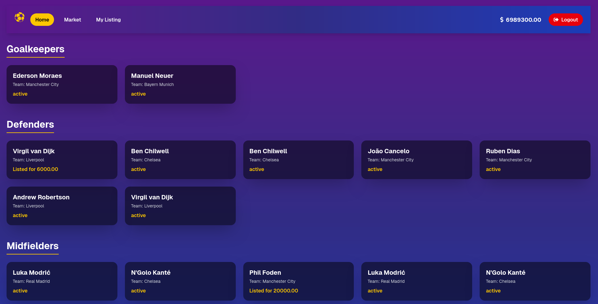

# ⚽ Fantasy Football Manager

Welcome to **Fantasy Football Manager**! 🎉  
Build your dream team, buy/sell players, and dominate the transfer market.

---

## ✨ Features

### 👤 User Authentication
- Login or signup with **email & password** in a single form.
- **JWT-based authentication** keeps you safe and secure.

### 🏟️ Team Management
- Every new user starts with **20 players** and **$5,000,000** 💰.
- Players include **Goalkeepers, Defenders, Midfielders, and Attackers**.
- View your team on the **Home page** with **fantasy-style cards**.

### 🛒 Transfer Market
- Buy players listed by other users.
- Filter players by **name, team, or price**.
- Buy at **95% of the listed price** 🤑.
- Animated cards with **hover effects** for extra flair.

### 📋 My Listings
- Add/remove your players to/from the transfer market.
- Set your own **asking price**.
- Filter your listings by **max price**.

### 💻 Frontend
- Built with **React.js + Next.js + Tailwind CSS**.
- Fantasy-style design with **animated cards and gradients**.
- Fully **responsive** across all devices.

### ⚡ Backend
- Powered by **Node.js + Express + MySQL**.
- Handles authentication, team generation, player listing, buying, and selling.

---

## 🔗 API Endpoints

- `POST /api/login` → Login or signup user  
- `GET /api/` → Get current user and team  
- `GET /api/market` → Get all listed players  
- `POST /api/buy/:playerId` → Buy a player  
- `GET /api/my-listing` → Get your listed players  
- `POST /api/add-listing/:playerId` → Add a player to market  
- `DELETE /api/remove-listing/:playerId` → Remove a player from market  

---

## 🚀 Setup Instructions
You can find the instructions for **frontend** and **backend** in their respective folder `README.md` files.

## 🕒 Time Report

| Section | Description | Time Spent |
|----------|--------------|-------------|
| **Backend Development** | API endpoints for authentication, player management, listings, market filtering, and user data retrieval. Tested with Postman. | **1.5 hours** |
| **Frontend Setup** | Initialized React/Next.js project with Tailwind CSS, configured routes, and folder structure. | **0.5 hours** |
| **Authentication Pages** | Built Login page with API integration, CORS handling, and user redirection logic. | **0.5 hours** |
| **Home Page Design** | Fantasy-themed dashboard displaying user balance and player lineup with position grouping and animations. | **1 hour** |
| **Market Page** | Implemented player listing with search and price filters, styled cards with fantasy design. | **0.75 hours** |
| **My Listings Page** | Added player management (add/remove listings) and modal for player selection with smooth UI. | **0.5 hours** |
| **Testing & Final Touches** | Refined UI, improved Navbar reusability, metadata (titles), and minor bug fixes. | **0.25 hours** |

**Total Time Spent:** ≈ **5 hours**

# football-team-manager
